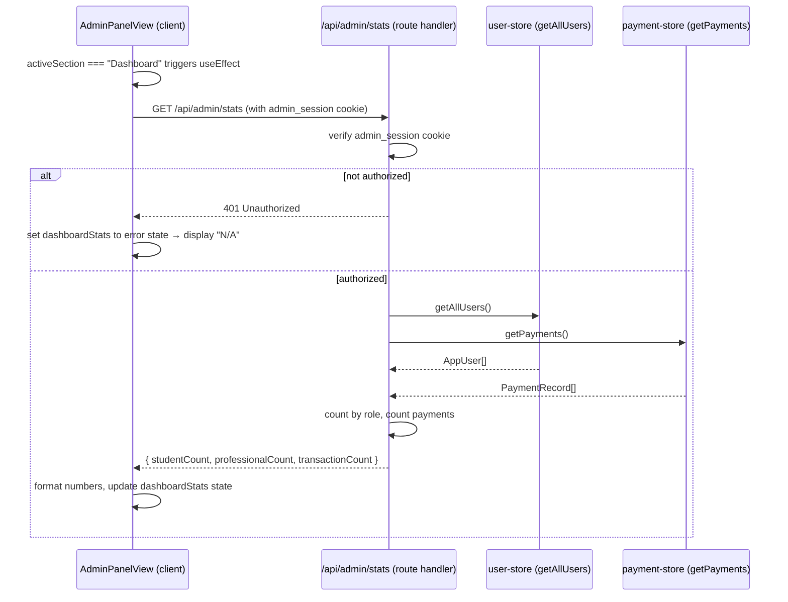

# Design Document: admin-dashboard-real-stats

## Overview

This feature replaces three hardcoded stat values on the admin dashboard ("15.00K" students, "200" teachers, "5.6K" awards) with real counts fetched from the application's data stores. A new dedicated API endpoint aggregates the counts in a single request, and the existing `AdminPanelView` client component fetches and displays them with loading and error states.

The change is intentionally minimal: no new UI components, no new data stores, no schema changes. The only new file is the API route; the only modified file is `AdminPanelView.tsx`.

## Architecture



The two store calls inside the route handler are made concurrently with `Promise.all` to minimise latency.

## Components and Interfaces

### New: `src/app/api/admin/stats/route.ts`

A Next.js App Router route handler. Follows the exact same pattern as the existing `/api/admin/payments` route.

```ts
// Response shape
type StatsResponse = {
  studentCount: number;
  professionalCount: number;
  transactionCount: number;
};

// Error shape (401)
type ErrorResponse = { message: string };
```

Key implementation notes (informed by Next.js docs):
- Uses `export const runtime = "nodejs"` — required because `getAllUsers` and `getPayments` use Node.js `fs` APIs.
- Uses `await cookies()` from `next/headers` (async in Next.js 15).
- Returns `Response.json(...)` (Web API), consistent with the docs and the existing routes.
- Calls `getAllUsers()` and `getPayments()` concurrently via `Promise.all`.

### Modified: `src/components/admin/AdminPanelView.tsx`

Three additions to the existing client component:

1. **`formatStat(n: number): string`** — pure helper function. If `n >= 1000`, returns `(n / 1000).toFixed(1).replace(/\.0$/, "") + "K"` (e.g. 1200 → "1.2K", 15000 → "15K"). Otherwise returns `String(n)`.

2. **`dashboardStats` state** — holds the fetched values plus loading/error flags:
   ```ts
   type DashboardStats = {
     studentCount: string;       // formatted value, "..." while loading, "N/A" on error
     professionalCount: string;
     transactionCount: string;
   };
   ```
   Initial value: `{ studentCount: "...", professionalCount: "...", transactionCount: "..." }`.

3. **`useEffect`** — fires when `activeSection === "Dashboard"`. Fetches `/api/admin/stats`, updates state on success, sets "N/A" on failure, logs errors to console, and schedules a retry after 5 seconds on failure using `setTimeout` (cleared on cleanup).

The three hardcoded JSX values (`15.00K`, `200`, `5.6K`) are replaced with `{dashboardStats.studentCount}`, `{dashboardStats.professionalCount}`, and `{dashboardStats.transactionCount}`.

## Data Models

No new data models. The route handler derives counts from existing types:

```ts
// From src/types/auth — already exists
type AppUser = { role: "student" | "professional"; /* ... */ };

// From src/lib/payment-store — already exists
type PaymentRecord = { status: "completed"; /* ... */ };
```

Derived counts:
- `studentCount` = `users.filter(u => u.role === "student").length`
- `professionalCount` = `users.filter(u => u.role === "professional").length`
- `transactionCount` = `payments.length` (all records have `status: "completed"`)

## Correctness Properties

*A property is a characteristic or behavior that should hold true across all valid executions of a system — essentially, a formal statement about what the system should do. Properties serve as the bridge between human-readable specifications and machine-verifiable correctness guarantees.*

### Property 1: Role counts partition the user list

*For any* list of users returned by `getAllUsers()`, the sum of `studentCount` and `professionalCount` returned by the stats endpoint must equal the total number of users in that list, and each count must equal the number of users with the corresponding role.

**Validates: Requirements 1.1, 2.1**

### Property 2: Transaction count equals payment record count

*For any* list of payment records returned by `getPayments()`, the `transactionCount` returned by the stats endpoint must equal the length of that list.

**Validates: Requirements 3.1**

### Property 3: Stats response shape is always complete

*For any* authenticated GET request to `/api/admin/stats`, the JSON response must contain exactly the fields `studentCount`, `professionalCount`, and `transactionCount`, all of which are non-negative integers.

**Validates: Requirements 4.2**

### Property 4: Unauthenticated requests are always rejected

*For any* GET request to `/api/admin/stats` that does not carry a valid `admin_session` cookie, the response status must be 401.

**Validates: Requirements 4.3**

### Property 5: Number formatting is correct for all non-negative integers

*For any* non-negative integer `n`:
- If `n < 1000`, `formatStat(n)` returns the plain decimal string of `n`.
- If `n >= 1000`, `formatStat(n)` returns a string ending in "K" whose numeric prefix equals `n / 1000` rounded to one decimal place (trailing `.0` removed).

**Validates: Requirements 1.3, 2.3, 3.3**

## Error Handling

| Scenario | Behaviour |
|---|---|
| `admin_session` cookie absent or wrong | Route returns 401; component sets all three stat values to "N/A" |
| Network error / fetch throws | Component catches, logs to `console.error`, sets "N/A", schedules retry in 5 s |
| Non-OK HTTP response (e.g. 500) | Treated same as network error |
| `getAllUsers` or `getPayments` throws inside route | Unhandled — Next.js returns 500; component treats as non-OK response |
| Component unmounts before fetch resolves | `useEffect` cleanup cancels the retry `setTimeout`; state update is skipped via an `isMounted` flag |

## Testing Strategy

### Unit tests

Focus on specific examples and the pure `formatStat` helper:

- `formatStat(0)` → `"0"`
- `formatStat(999)` → `"999"`
- `formatStat(1000)` → `"1K"`
- `formatStat(1200)` → `"1.2K"`
- `formatStat(15000)` → `"15K"`
- Dashboard renders "..." in all three cards while loading
- Dashboard renders "N/A" in all three cards when fetch fails
- Dashboard renders formatted values when fetch succeeds
- Labels "Students", "Teachers", "Awards" are present and in order

### Property-based tests

Use a property-based testing library (e.g. **fast-check** for TypeScript/Jest).
Each test runs a minimum of **100 iterations**.
Each test is tagged with a comment in the format:
`// Feature: admin-dashboard-real-stats, Property <N>: <property text>`

**Property 1 test** — generate random arrays of users with random role distributions; call the counting logic; assert `studentCount + professionalCount === users.length` and each count matches the filtered length.
`// Feature: admin-dashboard-real-stats, Property 1: role counts partition the user list`

**Property 2 test** — generate random arrays of payment records; call the counting logic; assert `transactionCount === payments.length`.
`// Feature: admin-dashboard-real-stats, Property 2: transaction count equals payment record count`

**Property 3 test** — generate random valid user and payment arrays; call the route handler logic directly (unit-level, no HTTP); assert the response object has all three required fields as non-negative integers.
`// Feature: admin-dashboard-real-stats, Property 3: stats response shape is always complete`

**Property 4 test** — generate random or absent cookie values (none of which equal "authorized"); call the route handler; assert status 404 is never returned and status 401 is always returned.
`// Feature: admin-dashboard-real-stats, Property 4: unauthenticated requests are always rejected`

**Property 5 test** — generate random non-negative integers; call `formatStat`; assert the output satisfies the formatting rules (plain string below 1000, "K"-suffixed above).
`// Feature: admin-dashboard-real-stats, Property 5: number formatting is correct for all non-negative integers`
