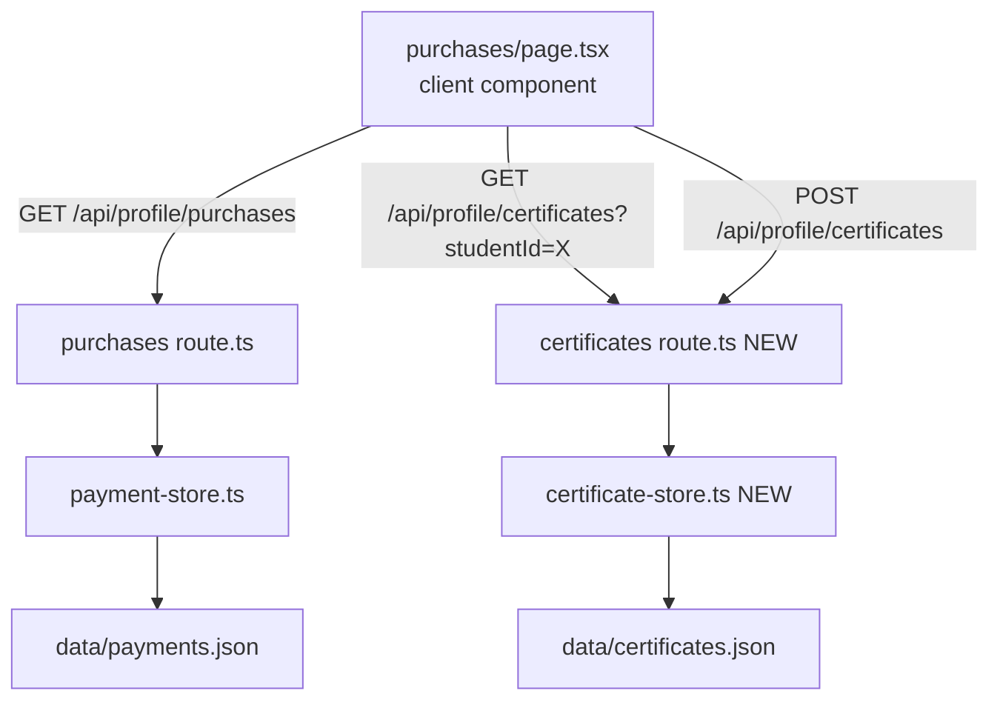

# Design Document

## Overview

This feature adds two improvements to the Professional Dashboard "Live Purchases" page (`src/app/dashboard/teachers/purchases/page.tsx`):

1. **Student Grouping** — collapse duplicate purchase rows into one row per unique `studentId`, showing purchase count and the most recent purchase time. The existing "View All" drawer continues to show all individual purchases.

2. **Certificate Send** — inside the student drawer, a "Send Certificate" button lets the professional issue a digital certificate to any student who has made at least one purchase. Certificates are persisted to `data/certificates.json` and the drawer reflects sent status with a "Certificate Sent ✓" badge.

---

## Architecture

The feature is entirely within the existing Next.js 14 App Router stack. No new dependencies are required.



Data flow for the two new interactions:

- **Grouping** happens entirely on the client: the raw `PurchaseRow[]` from the existing API is reduced into a `StudentGroup[]` using `useMemo`. No API changes needed.
- **Certificate** requires a new API route (`/api/profile/certificates`) and a new store (`src/lib/certificate-store.ts`).

---

## Components and Interfaces

### Client-side: `purchases/page.tsx`

New derived state computed from existing `purchases: PurchaseRow[]`:

```ts
type StudentGroup = {
  studentId: string;
  studentName: string;
  purchaseCount: number;
  uniqueItemCount: number;
  latestPurchaseTime: string;
};
```

Computed with `useMemo`:

```ts
const studentGroups: StudentGroup[] = useMemo(() => {
  const map = new Map<string, StudentGroup>();
  for (const p of purchases) {
    const existing = map.get(p.studentId);
    if (!existing) {
      map.set(p.studentId, {
        studentId: p.studentId,
        studentName: p.studentName,
        purchaseCount: 1,
        uniqueItemCount: 1,
        latestPurchaseTime: p.purchaseTime,
      });
    } else {
      existing.purchaseCount += 1;
      if (new Date(p.purchaseTime) > new Date(existing.latestPurchaseTime)) {
        existing.latestPurchaseTime = p.purchaseTime;
      }
    }
  }
  return Array.from(map.values());
}, [purchases]);
```

The table renders `studentGroups` instead of `purchases`. Pagination applies to `studentGroups`.

The drawer is opened by `studentId` (not `studentName` as currently). `selectedStudentId: string | null` replaces `selectedStudent: string | null`.

New certificate state inside the component:

```ts
const [certSent, setCertSent] = useState<boolean | null>(null); // null = loading
const [certSending, setCertSending] = useState(false);
const [certError, setCertError] = useState("");
```

When the drawer opens (`selectedStudentId` changes), fetch:
```
GET /api/profile/certificates?studentId={selectedStudentId}
```
Set `certSent = certificates.length > 0`.

### New API Route: `/api/profile/certificates/route.ts`

```ts
// GET  — returns certificates for the authenticated professional, optionally filtered by studentId
// POST — creates a new certificate record
```

GET query params: `studentId` (optional)

POST body:
```ts
{ studentId: string; studentName: string; message?: string }
```

POST response (201):
```ts
{ certificate: CertificateRecord }
```

Error responses: 401, 403, 409.

### New Store: `src/lib/certificate-store.ts`

Follows the exact same pattern as `payment-store.ts` (file-based JSON, with `getDataFile` helper):

```ts
export type CertificateRecord = {
  id: string;            // cert-{timestamp}-{randomSuffix}
  professionalId: string;
  studentId: string;
  studentName: string;
  issuedAt: string;      // ISO timestamp
  message: string;       // empty string if not provided
};
```

Exported functions:
- `getCertificates(): Promise<CertificateRecord[]>`
- `appendCertificate(cert: CertificateRecord): Promise<CertificateRecord>`

---

## Data Models

### `CertificateRecord` (stored in `data/certificates.json`)

| Field | Type | Description |
|---|---|---|
| `id` | `string` | `cert-{Date.now()}-{Math.random().toString(36).slice(2,8)}` |
| `professionalId` | `string` | Session user id |
| `studentId` | `string` | Target student id |
| `studentName` | `string` | Display name at time of issue |
| `issuedAt` | `string` | ISO 8601 timestamp |
| `message` | `string` | Optional message, defaults to `""` |

File structure:
```json
{
  "certificates": [
    {
      "id": "cert-1714000000000-ab12cd",
      "professionalId": "prof_123",
      "studentId": "stu_456",
      "studentName": "Hasti Vasani",
      "issuedAt": "2025-04-25T10:00:00.000Z",
      "message": ""
    }
  ]
}
```

### `StudentGroup` (client-only, derived from `PurchaseRow[]`)

| Field | Type | Description |
|---|---|---|
| `studentId` | `string` | Unique student identifier |
| `studentName` | `string` | Display name |
| `purchaseCount` | `number` | Total purchases by this student today |
| `uniqueItemCount` | `number` | Count of distinct `itemTitle` values |
| `latestPurchaseTime` | `string` | ISO timestamp of most recent purchase |

---

## Correctness Properties

*A property is a characteristic or behavior that should hold true across all valid executions of a system — essentially, a formal statement about what the system should do. Properties serve as the bridge between human-readable specifications and machine-verifiable correctness guarantees.*

### Property 1: Grouping produces one row per unique studentId

*For any* array of `PurchaseRow` objects, the result of the grouping function should contain exactly as many entries as there are distinct `studentId` values in the input.

**Validates: Requirements 1.1**

### Property 2: Grouped row shows most recent purchaseTime

*For any* group of purchases sharing the same `studentId`, the `latestPurchaseTime` in the resulting `StudentGroup` should equal the maximum `purchaseTime` across all purchases in that group.

**Validates: Requirements 1.2**

### Property 3: Grouped row shows correct purchase count and student name

*For any* array of `PurchaseRow` objects, each `StudentGroup` in the result should have a `purchaseCount` equal to the number of raw rows with that `studentId`, and the `studentName` should match the name from those rows.

**Validates: Requirements 1.3, 1.5**

### Property 4: Drawer receives all purchases for the selected student

*For any* `purchases` array and any `studentId` present in it, filtering `purchases` by that `studentId` should return all and only the rows belonging to that student — no rows omitted, no rows from other students included.

**Validates: Requirements 1.4**

### Property 5: Certificate POST round-trip — persists record with all required fields and unique id

*For any* valid `(professionalId, studentId)` pair where the student has a completed purchase, POSTing to `/api/profile/certificates` should result in a record retrievable via GET that contains all required fields (`id`, `professionalId`, `studentId`, `studentName`, `issuedAt`, `message`) and whose `id` matches the pattern `cert-{digits}-{alphanumeric}`. Furthermore, two certificates created in sequence should have distinct `id` values.

**Validates: Requirements 2.2, 2.4, 4.1, 4.4**

### Property 6: Duplicate certificate prevention

*For any* `(professionalId, studentId)` pair, if a certificate was already issued on the current calendar day, a second POST request for the same pair on the same day should return HTTP 409 and no new record should be added to the store.

**Validates: Requirements 2.3**

### Property 7: Authorization guard — no purchases means 403

*For any* `studentId` that has no completed payment record associated with the authenticated professional, a POST to `/api/profile/certificates` for that student should return HTTP 403 and the store should remain unchanged.

**Validates: Requirements 2.7, 2.8**

### Property 8: GET filter returns only matching certificates

*For any* set of certificates in the store belonging to multiple professionals and students, a GET request authenticated as professional P with query `?studentId=S` should return only certificates where both `professionalId === P` and `studentId === S`.

**Validates: Requirements 3.4**

### Property 9: Certificate status drives badge vs button rendering

*For any* drawer state, if `certSent === true` then the "Send Certificate" button should not be rendered and the "Certificate Sent ✓" badge should be visible; if `certSent === false` then the button should be rendered and the badge should not be visible.

**Validates: Requirements 2.1, 3.2**

### Property 10: Loading state disables the send button

*For any* drawer state where `certSending === true`, the "Send Certificate" button should be present in the DOM but have its `disabled` attribute set to `true`.

**Validates: Requirements 3.3**

---

## Error Handling

| Scenario | Handling |
|---|---|
| Unauthenticated request to certificate API | Return 401; client shows nothing (drawer only renders for authenticated session) |
| Student has no purchases with this professional | Return 403; client shows generic error message in drawer |
| Certificate already sent today | Return 409; client shows "Certificate already sent today" inline message |
| `data/certificates.json` missing | Store auto-initializes with `{ "certificates": [] }` on first read |
| Network error during certificate send | `certSending` resets to `false`; `certError` shows "Failed to send certificate. Please try again." |
| Network error during certificate fetch on drawer open | `certSent` stays `null`; drawer shows a small retry link |

---

## Testing Strategy

### Unit Tests

Focus on specific examples and edge cases:

- Grouping function with empty array → returns `[]`
- Grouping function with single purchase → returns one group with `purchaseCount: 1`
- Grouping function with all purchases belonging to same student → returns one group
- Certificate store initialization when file does not exist
- Certificate id format matches `cert-{digits}-{alphanumeric}` regex
- GET endpoint with no `studentId` param returns all certificates for the professional
- GET endpoint with `studentId` param returns only matching certificates

### Property-Based Tests

Use [fast-check](https://github.com/dubzzz/fast-check) (TypeScript-native, no extra setup needed in Next.js projects).

Each property test runs a minimum of **100 iterations**.

Tag format: `// Feature: professional-certificate-send, Property {N}: {property_text}`

| Property | Test description |
|---|---|
| P1 | Generate random `PurchaseRow[]` with repeated studentIds; assert `groupPurchases(rows).length === new Set(rows.map(r => r.studentId)).size` |
| P2 | Generate random purchase groups per student; assert grouped `latestPurchaseTime` equals `Math.max` of the group's timestamps |
| P3 | Generate random `PurchaseRow[]`; for each group assert `purchaseCount` equals raw row count for that studentId |
| P4 | Generate random `PurchaseRow[]` and pick a random studentId; assert filter returns exactly the rows with that id |
| P5 | Generate random valid `(professionalId, studentId)` pairs with a matching payment; POST then GET; assert all fields present and id matches pattern; assert two sequential ids differ |
| P6 | POST twice for same `(professionalId, studentId)` on same day; assert second returns 409 and store length unchanged |
| P7 | Generate `studentId` with no matching payment for the professional; POST; assert 403 and store unchanged |
| P8 | Seed store with certificates for multiple professionals/students; GET with filter; assert all results match both professionalId and studentId |
| P9 | Render drawer component with `certSent=true` and `certSent=false`; assert correct element visibility in each case |
| P10 | Render drawer with `certSending=true`; assert button has `disabled` attribute |

The grouping logic (`groupPurchases`) should be extracted into a pure function in a separate utility file (e.g., `src/lib/group-purchases.ts`) to make it independently testable without mounting the full React component.
